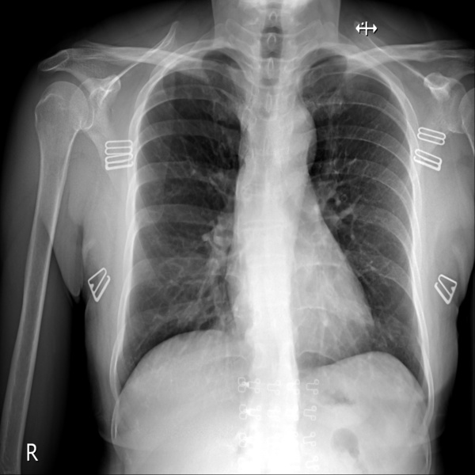
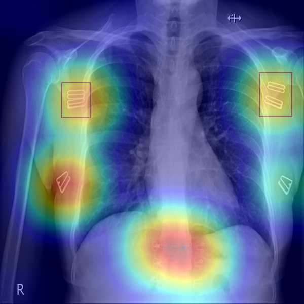
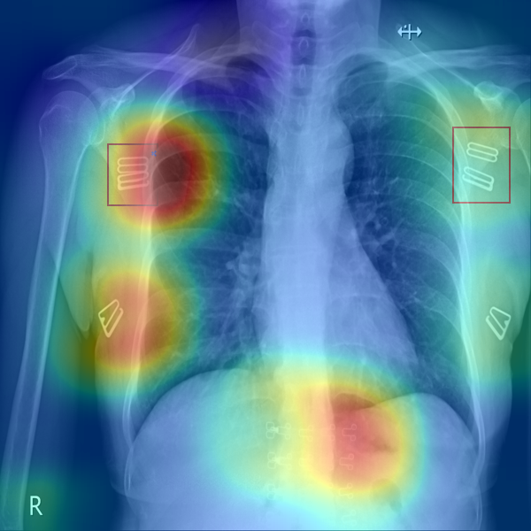

# Explainable Medical Image Quality Analysis 

## Summary
In this work, we propose an explainable image quality assessment system and demonstrate it on foreign object detection on Chest X-Rays (Object-CXR) and Left Ventricular Outflow Tract (LVOT) detection on Cardiac Magnetic Resonance (CMR) volumes. We apply numerous techniques to measure the consistency of a saliency detector including:
- Smoothing
- Partial/Fully randomisation
- Repeatability through retraining with different seeds
- Reproducibility under different neural network architectures.

We find that NormGrad is superior to generic saliency detection methods in terms of consistency. We also show the importance of aggregating the information of different layers to accurately demonstrate the learning capability of a neural network.

Original Image | NormGrad | GradCAM
:--------:|:--------:|:-------:
 |  |

## Preparatory Steps

1. Create a new environment named eiqa and activate it by:

    `conda create --name eiqa python=3.7`

    `conda activate eiqa`

2. Install the necessary packages by entering:

    `pip install -r requirements.txt -f https://download.pytorch.org/whl/torch_stable.html`

3. Create a new folder named `images` with a following folder tree structure for the object-CXR dataset. The dataset can be found at [here](https://academictorrents.com/details/fdc91f11d7010f7259a05403fc9d00079a09f5d5/tech).

```
images
├── object-CXR_test
│   └── test.csv
│   └── images
|   │   └── 09001.jpg
|   │   └── 09002.jpg
            .
            .
├── object-CXR_val
│   └── dev.csv
│   └── images
|   │   └── 08001.jpg
|   │   └── 08002.jpg
            .
            .
```

## Usage

The results can be reproduced by executing the `*.sh` files. It will not only show the Pointing Game accuracies, but also record the attribution maps corresponding each image in each split.

## Legacy version of this repository

The former version of this repository is accessible through [midl branch](https://github.com/canerozer/explainable-iqa/tree/midl).

## Citation

```
@misc{ozer2023explainable,
      title={Explainable Image Quality Assessment for Medical Imaging}, 
      author={Caner Ozer and Arda Guler and Aysel Turkvatan Cansever and Ilkay Oksuz},
      year={2023},
      eprint={2303.14479},
      archivePrefix={arXiv},
      primaryClass={eess.IV}
}

@inproceedings{Ozer2021,
    title={Explainable Image Quality Analysis of Chest X-Rays},
    author={Ozer, Caner and Oksuz, Ilkay}
    booktitle={Medical Imaging with Deep Learning}
    year={2021}
    url={https://openreview.net/forum?id=ln797A8lAb0}
}
```